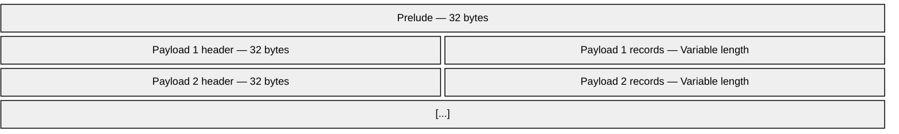

import DirectoryList from '@components/DirectoryList.astro';

The Stone format is a binary format designed to be type-safe and version-aware.
It is used to package and distribute software in aerynOS, in fact both the packages themselves
and the index file of repositories use the Stone format.

Anything encoded in the Stone format is called a *stone*.
Each *stone* is composed of a Prelude (the global header) and zero or more payloads, each with its own sub-header.
No limit is set for the length of a *stone*, but it will always be at least 32 bytes long, that is the size of
the Prelude.

To completely encode or decode a given *stone*, the Stone version must be taken into account,
as different versions may support different contents.
The version is stored in the Prelude, as explained in the pages to come.
For now, it is sufficient to remember that each *stone* targets exactly one version.

Described below is the general (that is, version-agnostic) layout of a *stone*.

```mermaid
%%{
  init: {
    'packet': {
       'showBits': false
    }
  }
}%%
packet
+32: "Prelude — 32 bytes"
+16: "Payload 1 header — 32 bytes"
+16: "Payload 1 records — Variable length"
+16: "Payload 2 header — 32 bytes"
+16: "Payload 2 records — Variable length"
+32: "[...]"
```

The first payload, if present, immediately follows the Prelude.

The fundamental types of the Stone format are integer numbers and strings.

| Type | Format | Size (bytes) | Description | Abbreviation|
|---|---|---|---|---|
| Signed integer | Big-endian | Variable | Integer number with a sign. When negative, two's complement is used. The range of values goes from -2^(n-1) to 2^(n-1)-1, where `n` is the number of bytes. |uint|
| Unsigned integer | Big-endian | Variable | Integer number without a sign. The range of values goes from 0 to 2^(n)-1, where `n` is the number of bytes. |int|
| String | UTF-8 | Variable | String of text, without the NULL termination. |str|
| Blob | Undetermined | Variable | Meaningless or context-dependent array of bytes. | blob

The length of a field is documented where it is known a priori.
When this is not possible, it is always paired with another field that reveals its actual length.
The position of the latter depends on the version of the Stone format in use.

The documentation will delve into the details of each section in the next pages.

<DirectoryList/>
